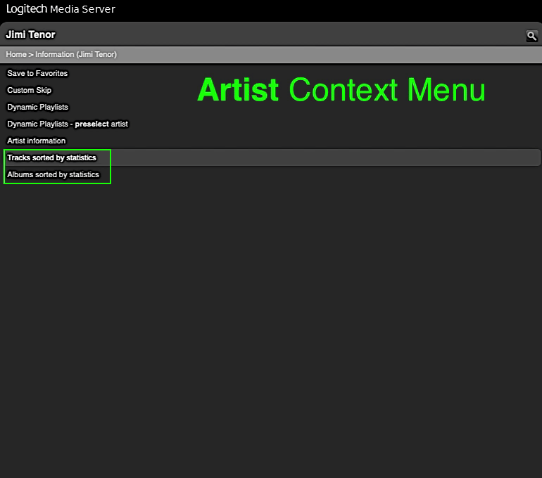

Context Stats
====
%3D'plugin'%20and%20%40name%3D'ContextStats'%5D%2F%40minTarget&prefix=v&label=Min.%20LMS%20Version%20Required&color=darkgreen) 

**Context Stats** lets you display lists of tracks, albums or artists *sorted by statistics* from the context menus of a selected artist, album, genre, year and playlist. Enabling *Display home menu item* in the plugin settings adds lists of tracks, albums or artists sorted by statistics for your **entire** music library.  For more general library statistics (e.g. genres with the most or best rated tracks), have a look at the [**Visual Statistics**](https://github.com/AF-1/#-visual-statistics) plugin.
   

<a href="https://github.com/AF-1/">⬅️ <b>Back to the list of all plugins</b></a>
   

## Screenshots[^1]

   

## Installation

**Context Stats** is available from the LMS plugin library: **LMS > Settings > Manage Plugins**. 

If you want to test a new patch that hasn't made it into a release version yet, you'll have to [install the plugin manually](https://github.com/AF-1/sobras/wiki/Manual-installation-of-LMS-plugins).
   

## Report a new issue

To report a new issue please file a GitHub [**issue report**](https://github.com/AF-1/lms-contextstats/issues/new/choose).
   

## ⭐ Help others discover this project

If you find this project useful, giving it a  (top right of this page) is a great way to show your support and help others discover it. Thank you.
    

## FAQ

»<b>What do <i>AvR, TR, AvPC, TPC, AvSC, TSC and DPSV</i> stand for?</b>«
 

- AvR = average rating 
- TR = total rating 
- AvPC = average play count 
- TPC = total play count 
- AvSC = average skip count 
- TSC = total skip count 
- DPSV = average dynamic played/skipped value.

 

»<b>In the lists of most/least total played or top total rated albums/artists, albums are sometimes listed more than once. Why?</b>«
 

This happens if the LMS database contains <i>more than one</i> contributor for the <i>same</i> contributor <i>role</i> (artist, album artist, track artist, band). 
Artists and albums lists in <i>Context Stats</i> will have items for each contributor (with identical total rating, play count and skip count values).

 

»<b>Can this plugin be <i>displayed in my language</i>?</b>«
 
If you want localized strings in your language, please read <a href="https://github.com/AF-1/sobras/wiki/Adding-localization-to-LMS-plugins"><b>this</b></a>.

   

[^1]: The screenshots might not correspond to the current UI in every detail.
